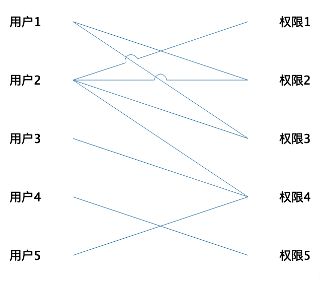
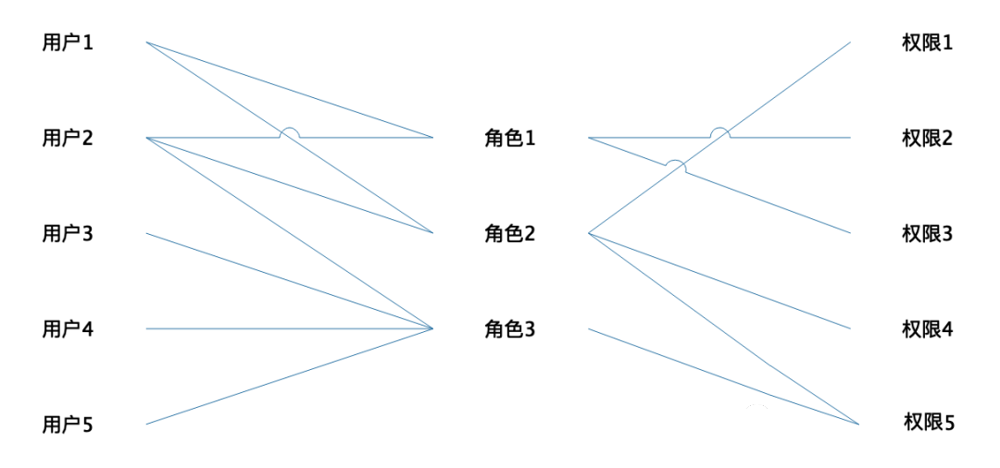
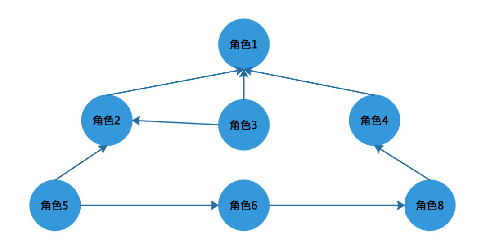
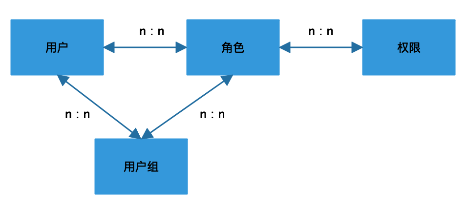
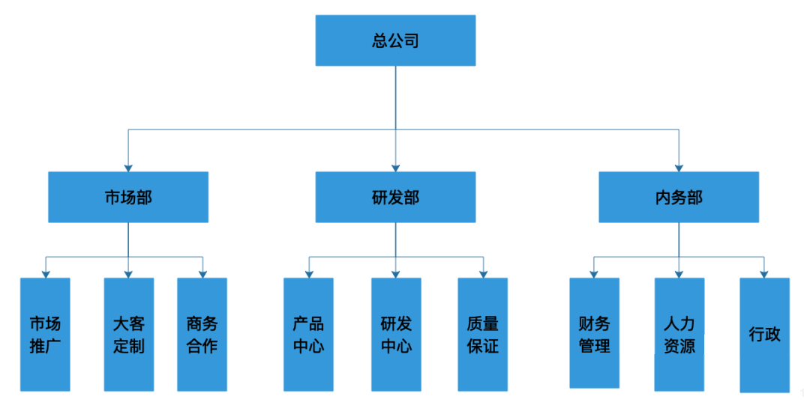
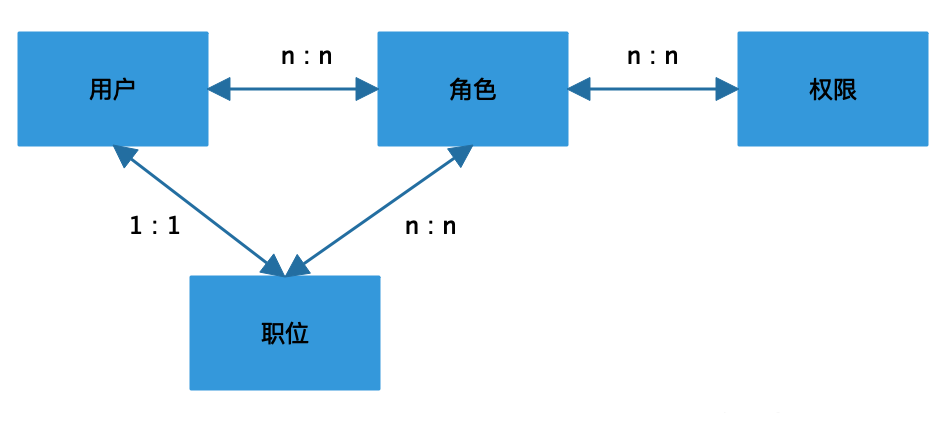
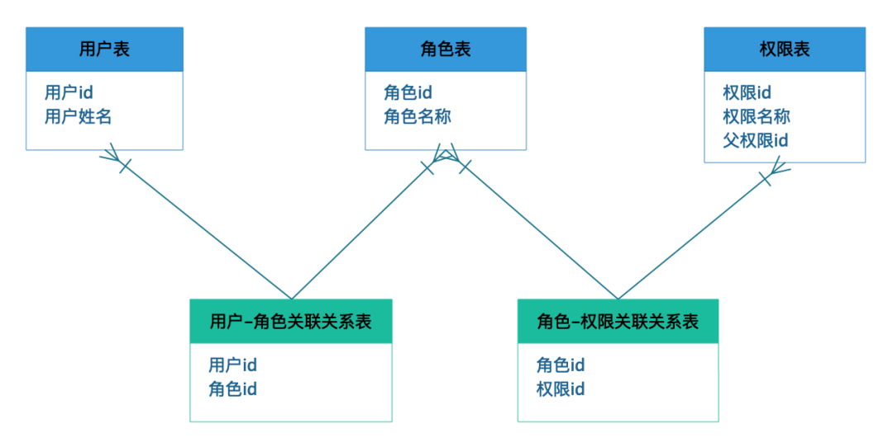

[[TOC]]

## 1 为什么需要权限管理

日常工作中权限的问题时时刻刻伴随着我们，程序员新入职一家公司需要找人开通各种权限，比如网络连接的权限、编码下载提交的权限、监控平台登录的权限、运营平台查数据的权限等等。

**在很多时候我们会觉得这么多繁杂的申请给工作带来不便，并且如果突然想要查一些数据，发现没有申请过权限，需要再走审批流程，时间拉得会很长。那为什么还需要这么严格的权限管理呢？**

举个例子，一家支付公司有运营后台，运营后台可以查到所有的商户信息，法人代表信息，交易信息以及费率配置信息，如果我们把这些信息不加筛选都给到公司的每一个小伙伴，那么跑市场的都可以操作商家的费率信息，如果一个不小心把费率改了会造成巨大的损失。

又比如商户的信息都是非常隐秘的，有些居心不良的小伙伴把这些信息拿出来卖给商家的竞争对手，会给商家造成严重的不良后果。虽然这么做都是个别人人为的过错，但是制度上如果本身这些信息不开放出来就能在很大程度上避免违法乱纪的事情发生了。

总体来讲**权限管理是公司数据安全的重要保证，针对不同的岗位，不同的级别看到的数据是不一样的，操作数据的限制也是不一样的**。比如涉及到资金的信息只开放给财务的相关岗位，涉及到配置的信息只开放给运营的相关岗位，这样各司其职能避免很多不必要的安全问题。

> 如何让各个岗位的人在系统上各司其职，就是权限管理要解决的问题。

## 2 权限模型

### **2.1 权限设计**

从业务分类上来讲权限可以分为数据查看权限，数据修改权限等，对应到系统设计中有页面权限、菜单权限、按钮权限等。菜单也分一级菜单、二级菜单甚至三级菜单，以csdn文章编辑页面左侧菜单栏为例是分了两级菜单。菜单对应的页面里又有很多按钮，我们在设计的时候最好把权限设计成树形结构，这样在申请权限的时候就可以一目了然的看到菜单的结构，需要哪些权限就非常的明了了。

如下图所示：

按照这个架构，按钮的父级是二级菜单，二级菜单的父级是一级菜单，这样用户申请权限的时候非常清晰的看到自己需要哪些权限。

## 2.2 为什么需要角色

权限结构梳理清晰之后，需要思考怎么把权限分配给用户，用户少的情况下，可以直接分配，一个用户可以有多个权限，统一一个权限可以被多个用户拥有，用户-权限的模型结构如下所示：

### **2.3 权限模型的演进**

#### 2.3.1 RBAC模型

有了角色之后可以把权限分配给角色，需要相同权限的用户和角色对应起来就可以了，一个权限可以分配给多个角色，一个角色可以拥有多个权限，同样一个用户可以分配多个角色，一个角色也可以对应多个用户，对应模型如下所示：

同时因为有角色作为媒介，大大降低了错综复杂的交互关系，比如一家有上万人的公司，角色可能只需要几百个就搞定了，因为很多用户需要的权限是一样的，分配一样的角色就可以了。这种模型的对应关系图如下所示：

用户和角色，角色和权限都是多对多的关系，这种模型是最通用的权限管理模型，节省了很大的权限维护成本， 但是实际的业务千变万化，权限管理的模型也需要根据不同的业务模型适当的调整，比如一个公司内部的组织架构是分层级的，层级越高权限越大，因为层级高的人不仅要拥有自己下属拥有的权限，二期还要有一些额外的权限。

RBAC模型可以给不同层级的人分配不同的角色，层级高的对应角色的权限就多，这样的处理方式可以解决问题，但是有没有更好的解决办法呢，答案肯定是有的，这就引出角色继承的RBAC模型。

#### 2.3.2 角色继承的RBAC模型

角色继承的RBAC模型又称RBAC1模型。每个公司都有自己的组织架构，比如公司里管理财务的人员有财务总监、财务主管、出纳员等，财务主管需要拥有但不限于出纳员的权限，财务总监需要拥有但不限于财务主管的权限，像这种管理关系向下兼容的模式就需要用到角色继承的RBAC模型。**角色继承的RBAC模型的思路是上层角色继承下层角色的所有权限，并且可以额外拥有其他权限。**

模型如下所示：

从模型图中可以看出下级角色拥有的权限，上级角色都拥有，并且上级角色可以拥有其他的权限。角色的层级关系可以分为两种，一种是下级角色只能拥有一个上级角色，但是上级角色可以拥有多个下级角色，这种结构用图形表示是一个树形结构，如下图所示：

还有一种关系是下级角色可以拥有多个上级角色，上级角色也可以拥有多个下级角色，这种结构用图形表示是一个有向无环图，如下图所示：

#### 2.3.3 带约束的RBAC模型

带约束的RBAC模型又成RBAC2模型。在实际工作中，为了安全的考虑会有很多约束条件，比如财务部里同一个人不能即是会计又是审核员，跟一个人同一时间不能即是运动员又是裁判员是一个道理的，又比如财务部的审核员不能超过2个，不能1个也没有。因为角色和权限是关联的，所以我们做好角色的约束就可以了。

> 常见的约束条件有：角色互斥、基数约束、先决条件约束等。

**角色互斥**：如果角色A和角色B是互斥关系的话，那么一个用户同一时间不能即拥有角色A，又拥有角色B，只能拥有其中的一个角色。

> 比如我们给一个用户赋予了会计的角色就不能同时再赋予审核员的角色，如果想拥有审核员的角色就必须先去掉会计的角色。假设提交角色和审核角色是互质的，我们可以用图形表示：

**基数约束**：同一个角色被分配的用户数量可以被限制，比如规定拥有超级管理员角色的用户有且只有1个；用户被分配的角色数量也需要被限制，角色被分配的权限数量也可以被限制。

**先决条件约束**：用户想被赋予上级角色，首先需要拥有下级角色，比如技术负责人的角色和普通技术员工角色是上下级关系，那么用户想要用户技术负责人的角色就要先拥有普通技术员工的角色。

### **2.4 用户划分**

#### 2.4.1 用户组

我们创建角色是为了解决用户数量大的情况下，用户分配权限繁琐以及用户-权限关系维护成本高的问题。抽象出一个角色，把需要一起操作的权限分配给这个角色，把角色赋予用户，用户就拥有了角色上的权限，这样避免了一个个的给用户分配权限，节省了大量的资源。

同样的如果有一批用户需要相同的角色，我们也需要一个个的给用户分配角色，比如一个公司的客服部门有500多个人，有一天研发部研发了一套查询后台数据的产品，客服的小伙伴都需要使用，但是客服由于之前并没有统一的一个角色给到所有的客服小伙伴，这时候需要新加一个角色，把权限分配给该角色，然后再把角色一个个分配给客服人员，这时候会发现给500个用户一个个添加角色非常的麻烦。但是客服人员又有共同的属性，所以我们可以创建一个用户组，所有的客服人员都属于客服用户组，把角色分配给客服用户组，这个用户组下面的所有用户就拥有了需要的权限。

RBAC模型添加用户组之后的模型图如下所示：

很多朋友会问，用户组和角色有什么区别呢？简单的来说，**用户组是一群用户的组合，而角色是用户和权限之间的桥梁**。用户组把相同属性的用户组合起来，比如同一个项目的开发、产品、测试可以是一个用户组，同一个部门的相同职位的员工可以是一个用户组， 一个用户组可以是一个职级，可以是一个部门，可以是一起做事情的来自不同岗位的人。

用户可以分组，权限也可以分组，权限特别多的情况下，可以把一个模块的权限组合起来成为一个权限组，权限组也是解决权限和角色对应关系复杂的问题。

比如我们定义权限的时候一级菜单、二级菜单、按钮都可以是权限，一个一级菜单下面有几十个二级菜单，每个二级菜单下面又有几十个按钮，这时候我们把权限一个个分配给角色也是非常麻烦的，可以采用分组的方法把权限分组，然后把分好的组赋予角色就可以了。

给权限分组也是个技术活，需要理清楚权限之间的关系，比如支付的运营后台我们需要查各种信息，账务的数据、订单的数据、商户的数据等等，这些查询的数据并不在一个页面，每个页面也有很多按钮，我们可以把这几个页面以及按钮对应的权限组合成一个权限组赋予角色。加入权限组之后的RBAC模型如下所示：

实际工作中我们很少给权限分组，给用户分组的场景会多一些，有的时候用户组也可以直接和权限关联，这个看实际的业务场景是否需要，权限模型没有统一的，业务越复杂业务模型会约多样化。

#### 2.4.2 组织

每个公司都有自己的组织架构，很多时候权限的分配可以根据组织架构来划分。因为同一个组织内的小伙伴使用的大部分权限是一样的。如下所示一个公司的组织架构图：

**实现权限分配的自动化**：和组织关系打通之后，按照组织来分配角色，如果有新入职的用户，被划分在某个组织下面之后，会自动获取该组织下所有的权限，无需人工分配。又比如有用户调岗，只需要把组织关系调整就可以了，权限会跟着组织关系自动调整，也无需人工干预。这么做首先需要把权限和组织关系打通。

**控制数据权限**：把角色关联到组织，组织里的成员只能看到本组织下的数据，比如市场推广和大客定制，市场推广针对的是零散的客户，大可定制针对的是有一定体量的客户，相互的数据虽然在一个平台，但是只能看自己组织下的数据。

加入组织之后的RBAC模型如下所示：

用户可以在多个组织中，因为组织也有层级结构，一个组织里只可以有多个用户，所以用户和组织的关系是多对多的关系，组织和角色的关系是一对一的关系。这个在工作中可以根据实际情况来确定对应关系。

#### 2.4.3 职位

一个组织下面会有很多职位，比如财务管理会有财务总监、财务主管、会计、出纳员等职位，每个职位需要的权限是不一样的，可以像组织那样根据职位来分配不同的角色，由于一个人的职位是固定的，所以用户跟职位的对应关系时一对一的关系，职位跟角色的对应关系可以是多对多的关系。加入职位的RBAC模型如下所示：

### **2.5 理想的RBAC模型**

RBAC模型根据不同业务场景的需要会有很多种演变，实际工作中业务是非常复杂的，权限分配也是非常复杂的，想要做出通用且高效的模型很困难。我们把RBAC模型的演变汇总起来会是一个支撑大数据量以及复杂业务的理想的模型。把RBAC、RBAC1、RBAC2、用户组、组织、职位汇总起来的模型如下所示：

按照这个模型基本上能够解决所有的权限问题，其中的对应关系可以根据实际的业务情况来确定，一般情况下，组织和职位是一对多的关系，特殊情况下可以有多对多的情况，需要根据实际情况来定。

理想的RBAC模型并不是说我们一开始建权限模型就可以这么做，而是数据体量、业务复杂度达到一定程度之后可以使用这个模型来解决权限的问题，如果数据量特别少，比如刚成立的公司只有十几个人，那完全可以用用户-权限模型，都没有必要使用RBAC模型。

## 3 权限系统表设计

### **3.1 标准RBAC模型表设计**

标准RBAC模型的表是比较简单了，要表示`用户-角色-权限`三者之前的关系，首先要创建用户表、角色表、权限表，用户和角色是多对多的关系，角色和权限是多对多的关系，需要再创建两章关系表，分别是用户-角色关系表和角色-权限关系表。这六张表的ER图如下所示：

### **3.2 理想RBAC模型表设计**

理想的RBAC模型是标准RBAC模型经过多次扩展得到的，表结构也会比较复杂，因为要维护很多关系，如下图所示是理想的RBAC模型的ER图：

这里面需要强调的是角色互斥表，互斥的关系可以放在角色上，也可以放在权限上，看实际工作的需求。

## 4 结语

本文从易到难非常详细的介绍了权限模型的设计，在工作中需要根据实际情况来定义模型，千人以内的公司使用RBAC模型是完全够用的，没有必要吧权限模型设计的过于复杂。模型的选择要根据具体情况，比如公司体量、业务类型、人员数量等。总之最适合自己公司的模型就是最好的模型，权限模式和设计模式是一样的，都是为了更好的解决问题，不要为了使用模型而使用模型。
