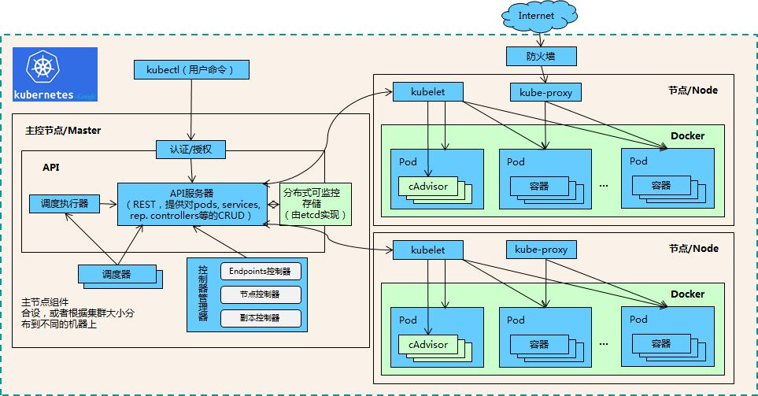

文章地址：https://www.cnblogs.com/jhno1/p/15269065.html

## Kubernetes基本概述

> kubernetes，简称 K8s，是用 8 代替 8 个字符“ubernete”而成的缩写。
> 
> 是一个开源的，用于管理云平台中多个主机上的容器化的应用，Kubernetes的目标是让部署容器化的应用简单并且高效，Kubernetes 提供了应用部署，规划，更新，维护的一种机制。
> 
> Kubernetes 是 Google 开源的一个容器编排引擎，它支持自动化部署、大规模可伸缩、应用容器化管理。
>
> Kubernetes 是一个可移植的、可扩展的开源平台，用于管理容器化的工作负载和服务，可促进声明式配置和自动化。
> 
> Kubernetes 拥有一个庞大且快速增长的生态系统。Kubernetes 的服务、支持和工具广泛可用。

## kubernetes 功能

- 1.自动装箱

  基于容器对应用运行环境的资源配置要求自动部署应用容器
- 2.自我修复(自愈能力)

  当容器失败时，会对容器进行重启
  当所部署的 Node 节点有问题时，会对容器进行重新部署和重新调度
  当容器未通过监控检查时，会关闭此容器直到容器正常运行时，才会对外提供服务
- 3.水平扩展

  通过简单的命令、用户 UI 界面或基于 CPU 等资源使用情况，对应用容器进行规模扩大或规模剪裁
- 4.服务发现

  用户不需使用额外的服务发现机制，就能够基于 Kubernetes 自身能力实现服务发现和负载均衡
- 5.滚动更新

  可以根据应用的变化，对应用容器运行的应用，进行一次性或批量式更新
- 6.版本回退

  可以根据应用部署情况，对应用容器运行的应用，进行历史版本即时回退
- 7.密钥和配置管理

  在不需要重新构建镜像的情况下，可以部署和更新密钥和应用配置，类似热部署。
- 8.存储编排

  自动实现存储系统挂载及应用，特别对有状态应用实现数据持久化非常重要

  存储系统可以来自于本地目录、网络存储(NFS、Gluster、Ceph 等)、公共云存储服务
- 9.批处理

  提供一次性任务，定时任务；满足批量数据处理和分析的场景

## 集群架构
> Kubernetes 遵循非常传统的客户端服务端架构，客户端通过 RESTful 接口或者直接使用 kubectl 与 Kubernetes 集群进行通信，

### Master
> 它主要负责接收客户端的请求，安排容器的执行并且运行控制循环，将集群的状态向目标状态进行迁移，Master 节点内部由三个组件构成:

- 1. API Server

  负责处理来自用户的请求，其主要作用就是对外提供 RESTful 的接口，包括用于查看集群状态的读请求以及改变集群状态的写请求，也是唯一一个与 etcd 集群通信的组件。

- 2. ControllerController

  管理器运行了一系列的控制器进程，这些进程会按照用户的期望状态在后台不断地调节整个集群中的对象，当服务的状态发生了改变，控制器就会发现这个改变并且开始向目标状态迁移。

- 3. SchedulerScheduler

  调度器其实为 Kubernetes 中运行的 Pod 选择部署的 Worker 节点，它会根据用户的需要选择最能满足请求的节点来运行 Pod，它会在每次需要调度 Pod 时执行。

### Node
> Node节点实现相对简单一点，主要是由kubelet和kube-proxy两部分组成：

