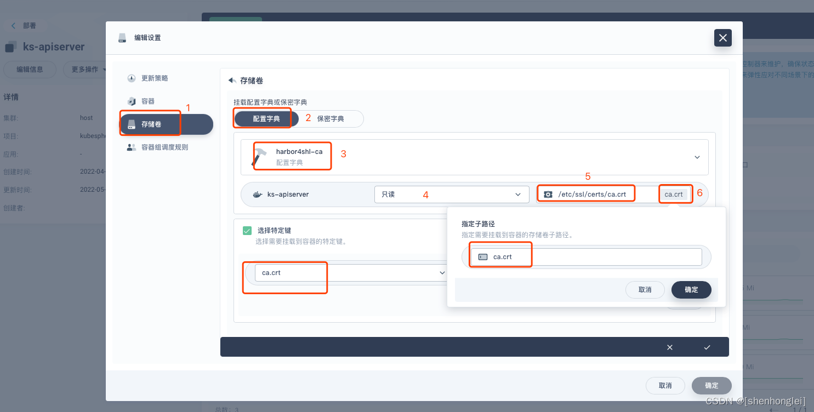
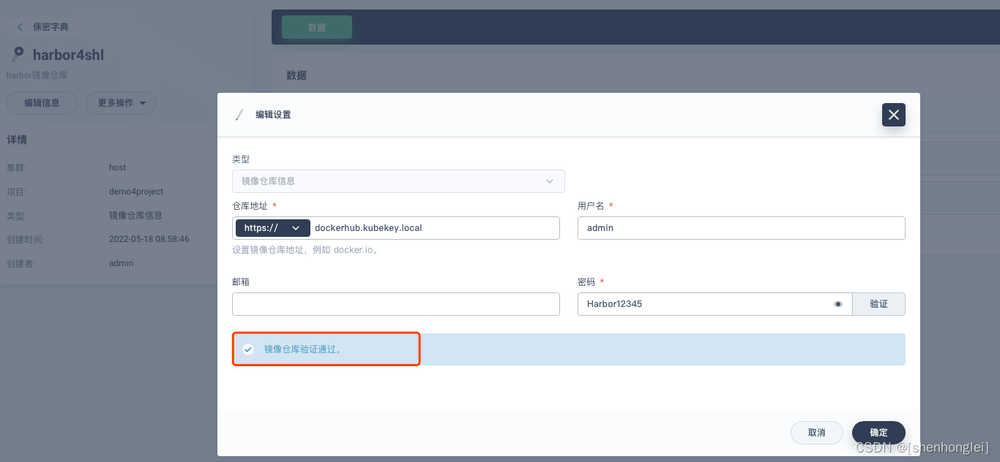

> KubeSphere 是在 Kubernetes 之上构建的面向云原生应用的分布式操作系统，完全开源，支持多云与多集群管理，提供全栈的 IT 自动化运维能力，简化企业的 DevOps 工作流
>
> 官网地址：[https://kubesphere.io/zh/](https://kubesphere.io/zh/)
>
> 文档地址：[https://www.bookstack.cn/read/kubesphere-3.3-zh/b22a6268e9a598a2.md](https://www.bookstack.cn/read/kubesphere-3.3-zh/b22a6268e9a598a2.md)

<!-- more -->

[[toc]]

## 安装前准备

### 1. 系统准备

> centos 下载地址：http://mirrors.aliyun.com/centos/7/isos/x86_64/

```bash
## 查看 centos 系统版本命令：
cat /etc/centos-release
```

### 2. 系统硬件检查

```bash
## 检查 CPU 核心数：
cat /proc/cpuinfo | grep "processor" | sort | uniq | wc -l
## 检查内存大小：
cat /proc/meminfo | grep MemTotal
## 检查可用磁盘大小：
df -hl
## 检查服务器节点磁盘分区：
lsblk -f
## 服务器架构
uname -m

## 服务器节点需要支持虚拟化。如果服务器节点不支持虚拟化，KSV 将以模拟模式运行。该模式将占用更多资源，且虚拟机相关模块无法使用。
## 检查服务器节点是否支持虚拟化（若无回显则不支持虚拟化）：
# x86 架构：
grep -E '(svm|vmx)' /proc/cpuinfo
# ARM64 架构
ls /dev/kvm
```

### 3. 系统内核检查

```bash
## 检查操作系统内核，低于4.7 请升级内核
uname -r

## 升级Linux内核版本
rpm -Uvh http://www.elrepo.org/elrepo-release-7.0-4.el7.elrepo.noarch.rpm
yum --enablerepo=elrepo-kernel install -y kernel-lt
rpm -qa | grep kernel
awk -F\' '$1=="menuentry " {print $2}' /etc/grub2.cfg
grub2-set-default 0
# 注意：设置完内核后，需要重启服务器才会生效。
reboot
uname -r
```

### 4. yum 源

```bash
# 1.下载安装wget
yum install -y wget
# 2.备份默认的yum
mv /etc/yum.repos.d /etc/yum.repos.d.backup && mkdir -p /etc/yum.repos.d
# 3.下载阿里yum配置到该目录中，选择对应版本
wget -O /etc/yum.repos.d/CentOS-Base.repo http://mirrors.aliyun.com/repo/Centos-7.repo
# 4.更新epel源为阿里云epel源
wget -O /etc/yum.repos.d/epel.repo http://mirrors.aliyun.com/repo/epel-7.repo
rpm -ivh http://mirrors.aliyun.com/epel/epel-release-latest-7.noarch.rpm
# 5.重建缓存
#yum clean all yum makecache
# 6.看一下yum仓库有多少包
#yum repolist
yum update

## 安装必要的依赖
yum -y update && yum install -y curl tree net-tools lsof htop openssl openssl-devel socat conntrack ebtables ipset lvm2 ipvsadm  yum-utils chrony epel-release conntrack-tools
# 命令补全
yum -y install bash-completion bash-completion-extras && source /etc/profile.d/bash_completion.sh
```

### 5. 时间同步

```bash
yum -y install ntp ntpdate
# ntpdate cn.pool.ntp.org
ntpdate time1.aliyun.com
hwclock --systohc
hwclock -w
# 时区不对的更改时区
mv /etc/localtime /etc/localtime.bak
ln -s /usr/share/zoneinfo/Asia/Shanghai /etc/localtime
date
```

### 6. 系统参数设置

```bash
## 关闭SELINUX 永久关闭需要修改SELINUX的配置文件
setenforce 0 && sed -i 's/^SELINUX=.*/SELINUX=disabled/' /etc/selinux/config
## 打开文件数调整
echo "* soft nofile 65536" >> /etc/security/limits.conf
echo "* hard nofile 65536" >> /etc/security/limits.conf
## 禁⽤交换分区
swapoff -a && sed -i '/ swap / s/^\(.*\)$/#\1/g' /etc/fstab
## 关闭防火墙
systemctl disable firewalld && systemctl stop firewalld && systemctl status firewalld
```

### 7. hostname 设置

```bash
## 按照规划设置
hostnamectl --static set-hostname k8s-node01
hostnamectl --static set-hostname k8s-node02
hostnamectl --static set-hostname k8s-node03
```

## 安装 docker

> 离线安装可自动安装，无需手动安装
>
> 版本要求：19.3.8+

```bash
## https://mirrors.aliyun.com/docker-ce/linux/static/stable/x86_64/docker-20.10.22.tgz

# curl -sSL https://get.daocloud.io/docker | sh
# systemctl start docker && systemctl enable docker && systemctl status docker

yum install -y yum-utils device-mapper-persistent-data lvm2
## 官方源
# yum-config-manager --add-repo https://download.docker.com/linux/centos/docker-ce.repo
yum-config-manager --add-repo https://mirrors.aliyun.com/docker-ce/linux/centos/docker-ce.repo
yum makecache fast
## 查看 docker 更新版本
yum list docker-ce --showduplicates | sort -r
#yum install docker-ce docker-ce-cli containerd.io
yum install -y docker-ce-20.10.8 docker-ce-cli-20.10.8 containerd.io-1.4.6
systemctl start docker && systemctl enable docker && systemctl status docker

# docker加速配置
sudo mkdir -p /etc/docker
sudo tee /etc/docker/daemon.json <<-'EOF'
{
  "registry-mirrors": ["https://82m9ar63.mirror.aliyuncs.com"],
}
EOF
sudo systemctl daemon-reload
sudo systemctl restart docker

## 确保sudo可执行docker
sudo docker version
ln -s /usr/local/bin/docker /usr/bin/docker
```

## kubeKey 安装

```bash
## 下载 KubeKey (master 节点执行即可)
## 可手动下载 https://github.com/kubesphere/kubekey/releases/tag/v3.0.2
##       wget https://github.com/kubesphere/kubekey/releases/download/v3.0.2/kubekey-v3.0.2-linux-amd64.tar.gz
export KKZONE=cn
curl -sfL https://get-kk.kubesphere.io | VERSION=v3.0.2 sh -
chmod +x kk
## 查看所有受支持的 Kubernetes 版本
./kk version --show-supported-k8s

## All-in-One 模式安装 KubeSphere
./kk create cluster --with-kubernetes v1.22.12 --with-kubesphere v3.3.1

## 创建示例配置文件 | 完整的配置地址：https://github.com/kubesphere/kubekey/blob/release-2.2/docs/config-example.md
./kk create config --with-kubernetes v1.21.14 --with-kubesphere v3.3.1 -f k8s.yaml
## 使用配置文件创建集群
./kk create cluster -f k8s.yaml
## 升级命令
./kk upgrade --with-kubernetes v1.22.12 --with-kubesphere v3.3.1 -f sample.yaml
## 删除集群
./kk delete cluster -f k8s.yaml

## 输入以下命令以检查安装结果
kubectl logs -n kubesphere-system $(kubectl get pod -n kubesphere-system -l 'app in (ks-install, ks-installer)' -o jsonpath='{.items[0].metadata.name}') -f


## 使用 KubeKey 检索集群信息。以下命令会创建配置文件 (sample.yaml)。
./kk create config --from-cluster
## 添加节点
./kk add nodes -f k8s.yaml
## 删除节点
./kk delete node <nodeName> -f k8s.yaml

## 查看证书到期时间
./kk certs check-expiration -f k8s.yaml
## 更新证书
./kk certs renew -f k8s.yaml
```

## 联邦集群

```bash
## 1、主集群
multicluster:
  clusterRole: host
  hostClusterName: k8s-master

kubectl logs -n kubesphere-system $(kubectl get pod -n kubesphere-system -l 'app in (ks-install, ks-installer)' -o jsonpath='{.items[0].metadata.name}') -f

kubectl -n kubesphere-system get cm kubesphere-config -o yaml | grep -v "apiVersion" | grep jwtSecret

## 2、成员集群
kubectl edit cc ks-installer -n kubesphere-system

authentication:
  jwtSecret: "gfdKWjo5P1OMrHJzQRzjJVpCF4nXNhR3"
multicluster:
  clusterRole: member
  hostClusterName: k8s-member-ty

kubectl logs -n kubesphere-system $(kubectl get pod -n kubesphere-system -l 'app in (ks-install, ks-installer)' -o jsonpath='{.items[0].metadata.name}') -f

## 3、导入集群
```

## 离线安装

> 官网：[https://kubesphere.io/zh/docs/v3.3/installing-on-linux/introduction/air-gapped-installation/#%E7%A6%BB%E7%BA%BF%E5%AE%89%E8%A3%85%E9%9B%86%E7%BE%A4](https://kubesphere.io/zh/docs/v3.3/installing-on-linux/introduction/air-gapped-installation/#%E7%A6%BB%E7%BA%BF%E5%AE%89%E8%A3%85%E9%9B%86%E7%BE%A4)

### 1. 下载资源

```bash
## 1. 下载kk
# 下载地址 https://github.com/kubesphere/kubekey/releases/tag/v3.0.2
wget https://github.com/kubesphere/kubekey/releases/download/v3.0.2/kubekey-v3.0.2-linux-amd64.tar.gz
tar -xzvf kubekey-v3.0.2-linux-amd64.tar.gz
## 2. 使用KK在已有的集群中创建manifest（可选）
# 可复制官方的文件：
./kk create manifest -f ks-v3.3.1-manifest-sample.yaml
## 3. 导出制品 artifact
export KKZONE=cn
./kk artifact export -m ks-v3.3.1-manifest-local.yaml -o ks-v3.3.1-artifact.tar.gz
## 4. 下载harbor脚本，并创建对应的项目
# 下载创建项目脚本模板
# curl -O https://raw.githubusercontent.com/kubesphere/ks-installer/master/scripts/create_project_harbor.sh
sh create_project_harbor.sh
## 5. 推送离线镜像到 Harbor 仓库
./kk artifact image push -f ks-v3.3.1-manifest-sample.yaml -a  ks-v3.3.1-artifact.tar.gz
```

### 2. 离线部署

```bash
## 1. 拷贝文件
# kubekey-v3.0.2-linux-amd64.tar.gz
# ks-v3.3.1-manifest-sample.yaml
# ks-v3.3.1-artifact.tar.gz

## 2. 执行以下命令创建离线集群配置文件
./kk create config --with-kubesphere v3.3.1 --with-kubernetes v1.22.12 -f ks-v3.3.1-config-local.yaml

## 执行以下命令安装镜像仓库
./kk init registry -f ks-v3.3.1-config-local.yaml -a ks-v3.3.1-artifact.tar.gz
## 创建集群并安装 OS 依赖   --with-packages：若需要安装操作系统依赖，需指定该选项。
./kk create cluster -f ks-v3.3.1-config-local.yaml -a ks-v3.3.1-artifact.tar.gz --with-packages


## 查看集群状态
kubectl logs -n kubesphere-system $(kubectl get pod -n kubesphere-system -l 'app in (ks-install, ks-installer)' -o jsonpath='{.items[0].metadata.name}') -f


---
## v3.0.0离线安装包
curl -Ok https://kubesphere-installer.pek3b.qingstor.com/offline/v3.0.0/kubesphere-all-v3.0.0-offline-linux-amd64.tar.gz
tar -zxvf kubesphere-all-v3.0.0-offline-linux-amd64.tar.gz
cd kubesphere-all-v3.0.0-offline-linux-amd64
./kk create config --with-kubesphere v3.0.0 --with-kubernetes v1.18.6
## 执行内部镜像仓库源
./kk init os -f config-sample.yaml -s ./dependencies/ --add-images-repo
## 推送镜像到私有仓库：
cd kubesphere-images-v3.0.0/
./push-images.sh  dockerhub.kubekey.local
## 开始部署
./kk create cluster -f config-sample.yaml
```


## F&A

### harbor证书认证
- Get"https://dockerhub.kubekey.local/v2/":x509:certificate signed by unknown authority
```bash
## 查看harbor证书
ls /etc/docker/certs.d/ca.crt
## 创建
kubectl create cm -n kubesphere-system harbor-ca --from-file=ca.crt
```
> 编辑 ks-apiserver deployment 文件，进行 configmap 的挂载



> 验证证书

