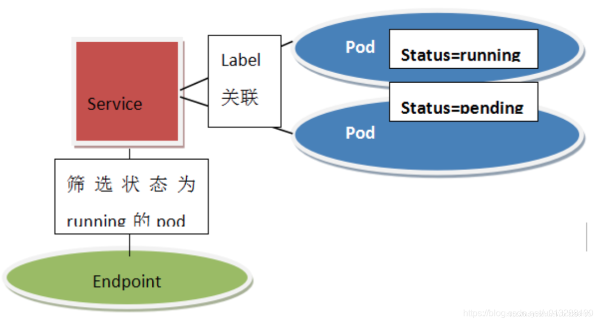

## 日常节点运维

```bash
## 列出集群中的所有节点
kubectl get nodes
kubectl get nodes -o wide
kubectl get nodes -o wide --show-labels=true

## 将节点标记为不可调度，避免新的Pod在此节点创建和运行：
kubectl cordon <node-name>

## 驱逐节点上的Pod容器组，被驱逐的Pod将在其它节点重新创建运行：
kubectl drain <node-name> --delete-local-data --ignore-daemonsets --force
# 这里有3个参数：
#   --ignore-daemonsets， 忽略 DaemonSet 管理的 Pod(避免删除,创建这样的死循环)。
#   --delete-local-data，使用 emptyDir 数据卷的 Pod 也要删除。
#   --force，不是由 ReplicationController 、ReplicaSet 、Job 、DaemonSet 、StatefulSet 管理的Pod(没有绑定任何控制器)也要删除。
```

## 创建 Namespace

```bash
cat >> ns-demo.yaml << EOF
apiVersion: v1
kind: Namespace
metadata:
  labels:
    pod-security.kubernetes.io/audit: privileged
    pod-security.kubernetes.io/enforce: privileged
    pod-security.kubernetes.io/warn: privileged
  name: ns-demo
EOF
```

## Endpoint

> Endpoint是可被访问的服务端点，即一个状态为running的pod，它是service访问的落点，只有service关联的pod才可能成为endpoint。
Endpoint、service和pod的关系
>
> Endpoints表示一个Service对应的所有Pod副本的访问地址。



```bash
kubectl get endpoints
```
