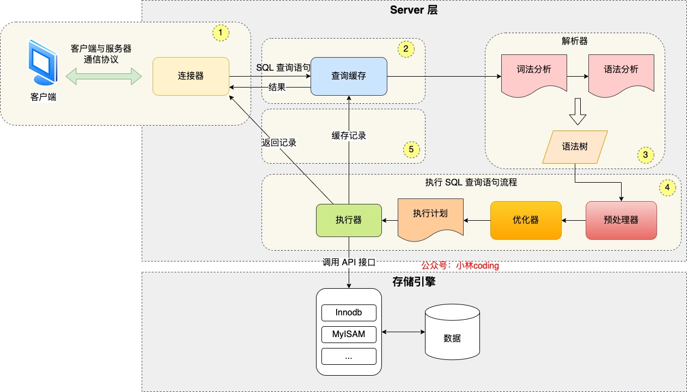

基础篇

# 1. 执行一条select语句，期间发生了什么？

连接器：建立连接，管理连接、校验用户身份；

查询缓存：查询语句如果命中查询缓存则直接返回，否则继续往下执行。MySQL 8.0 已删除该模块；

解析 SQL，通过解析器对 SQL 查询语句进行词法分析、语法分析，然后构建语法树，方便后续模块读取表名、字段、语句类型；

执行 SQL：执行 SQL 共有三个阶段：

- 预处理阶段：检查表或字段是否存在；将 select _ 中的 _ 符号扩展为表上的所有列。

- 优化阶段：基于查询成本的考虑， 选择查询成本最小的执行计划；

- 执行阶段：根据执行计划执行 SQL 查询语句，从存储引擎读取记录，返回给客户端；

示例：select查询语句

```sql
select * from product where id = 1;
```

MySQL架构分为两层：

Server层：负责建立连接，分析和执行SQL；

存储引擎层：负责数据的存储和提取。

流程步骤：

1、与数据库连接器建立连接；

2、查询缓存（已经弃用）；

3、解析SQL：词法分析和语法分析；

4、执行SQL：预处理器（检查表，字段是否存在）、优化器（选择哪种索引方式）、执行器（调用API接口，去与存储引擎交互）。



## 第一步：连接器

如果你在 Linux 操作系统里要使用 MySQL，那你第一步肯定是要先连接 MySQL 服务，然后才能执行 SQL 语句，普遍我们都是使用下面这条命令进行连接：

连接语句

```bash
# -h 指定 MySQL 服务的 IP 地址，如果是连接本地的 MySQL服务，可以不用这个参数；
# -u 指定用户名，管理员角色名为 root；
# -p 指定密码，如果命令行中不填写密码（为了密码安全，建议不要在命令行写密码），就需要在交互对话里面输入密码
mysql -h$ip -u$user -p
```

连接的过程需要先经过 TCP 三次握手，因为 MySQL 是基于 TCP 协议进行传输的。

如果用户密码都没有问题，连接器就会获取该用户的权限，然后保存起来，后续该用户在此连接里的任何操作，都会基于连接开始时读到的权限进行权限逻辑的判断。

所以，如果一个用户已经建立了连接，即使管理员中途修改了该用户的权限，也不会影响已经存在连接的权限。修改完成后，只有再新建的连接才会使用新的权限设置。

如何查看MySQL服务被多少个客户端连接了？

可以执行 show processlist 命令进行查看。

空闲连接会一直占用着吗？

不会。MySQL 定义了空闲连接的最大空闲时长，由 wait_timeout 参数控制的，默认值是 8 小时（28880秒），如果空闲连接超过了这个时间，连接器就会自动将它断开。也可以手动断开。

MySQL 的连接数有限制吗？

有，超过设置值就会拒绝接下来的请求。

类似于HTTP，MySQL的连接也有短连接和长连接的概念：短连接握手和挥手之间只能执行一条sql语句，长连接则可以执行许多条。

长连接：减少建立连接和断开连接的过程，但如果累计过多，导致内存占用过大可能会被kill掉。

如果解决长连接内存占用问题：

定期断开长连接；

客户端主动重置连接：当客户端执行一个很大的操作后，调用函数，主动释放内存，将连接恢复至刚建立的状态。

连接器的工作：

与客户端进行TCP三次握手建立连接；

校验客户端的用户名和密码，如不对，报错；

如对了，会读取该用户的权限，然后后面的权限逻辑判断都基于此时读取到的权限。

## 第二步：查询缓存

连接器得工作完成后，客户端就可以向 MySQL 服务发送 SQL 语句了，MySQL 服务收到 SQL 语句后，就会解析出 SQL 语句的第一个字段，看看是什么类型的语句。

如果 SQL 是查询语句（select 语句），MySQL 就会先去查询缓存（ Query Cache ）里查找缓存数据，看看之前有没有执行过这一条命令，这个查询缓存是以 key-value 形式保存在内存中的，key 为 SQL 查询语句，value 为 SQL 语句查询的结果。

如果查询的语句命中查询缓存，那么就会直接返回 value 给客户端。如果查询的语句没有命中查询缓存中，那么就要往下继续执行，等执行完后，查询的结果就会被存入查询缓存中。

对于更新比较频繁的表，查询缓存的命中率很低的，因为只要一个表有更新操作，那么这个表的查询缓存就会被清空。如果刚缓存了一个查询结果很大的数据，还没被使用的时候，刚好这个表有更新操作，查询缓冲就被清空了，相当于缓存了个寂寞。

MySQL8.0版本删掉了查询缓存的部分。

这里说的查询缓存是server层的，并不是Innodb存储引擎中的buffer pool。

## 第三步：解析SQL

在正式执行 SQL 查询语句之前， MySQL 会先对 SQL 语句做解析，这个工作交由「解析器」来完成。其会做以下两件事：

词法分析：MySQL 会根据你输入的字符串识别出关键字出来，构建出 SQL 语法树，这样方便后面模块获取 SQL 类型、表名、字段名、 where 条件等等。

语法分析：根据词法分析的结果，语法解析器会根据语法规则，判断你输入的这个 SQL 语句是否满足 MySQL 语法。

解析器只负责构建语法书和检查语法，不会查表和字段是否存在。

## 第四步：执行SQL

经过解析器后，接着就要进入执行 SQL 查询语句的流程了，每条SELECT 查询语句流程主要可以分为下面这三个阶段：

prepare 阶段，也就是预处理阶段（预处理器）：① 检查SQL查询语句中的表或字段是否存在 ② 将select* 中的*符号，拓展为表上所有列；

optimize 阶段，也就是优化阶段（优化器）：主要负责将 SQL 查询语句的执行方案确定下来，比如在表里面有多个索引的时候，优化器会基于查询成本的考虑，来决定选择使用哪个索引；

execute 阶段，也就是执行阶段（执行器）；执行语句（调用API接口，与存储引擎交互，单位为记录）。

理解MySQL索引：https://zhuanlan.zhihu.com/p/479164948

### 执行器

在执行的过程中，执行器就会和存储引擎交互了，交互是以记录为单位的。

接下来，用三种方式执行过程，跟大家说一下执行器和存储引擎的交互过程。

主键索引查询

全表扫描

索引下推

#### 1. 主键索引查询

例如：select \* from product where id = 1;

这条查询语句的查询条件用到了主键索引，而且是等值查询，同时主键 id 是唯一，不会有 id 相同的记录，所以优化器决定选用访问类型为 const 进行查询，也就是使用主键索引查询一条记录：

执行器第一次查询，会调用 read_first_record 函数指针指向的函数，因为优化器选择的访问类型为 const，这个函数指针被指向为 InnoDB 引擎索引查询的接口，把条件 id = 1 交给存储引擎，让存储引擎定位符合条件的第一条记录。

存储引擎通过主键索引的 B+ 树结构定位到 id = 1的第一条记录，如果记录是不存在的，就会向执行器上报记录找不到的错误，然后查询结束。如果记录是存在的，就会将记录返回给执行器；

执行器从存储引擎读到记录后，接着判断记录是否符合查询条件，如果符合则发送给客户端，如果不符合则跳过该记录。

执行器查询的过程是一个 while 循环，所以还会再查一次，但是这次因为不是第一次查询了，所以会调用 read_record 函数指针指向的函数，因为优化器选择的访问类型为 const，这个函数指针被指向为一个永远返回 - 1 的函数，所以当调用该函数的时候，执行器就退出循环，也就是结束查询了。

#### 2. 全表扫描

例如：select \* from product where name = 'iphone';

这条查询语句的查询条件没有用到索引，所以优化器决定选用访问类型为 ALL 进行查询，也就是全表扫描的方式查询，那么这时执行器与存储引擎的执行流程是这样的：

执行器第一次查询，会调用 read_first_record 函数指针指向的函数，因为优化器选择的访问类型为 all，这个函数指针被指向为 InnoDB 引擎全扫描的接口，让存储引擎读取表中的第一条记录；

执行器会判断读到的这条记录的 name 是不是 iphone，如果不是则跳过；如果是则将记录发给客户的（是的没错，Server 层每从存储引擎读到一条记录就会发送给客户端，之所以客户端显示的时候是直接显示所有记录的，是因为客户端是等查询语句查询完成后，才会显示出所有的记录）。

执行器查询的过程是一个 while 循环，所以还会再查一次，会调用 read_record 函数指针指向的函数，因为优化器选择的访问类型为 all，read_record 函数指针指向的还是 InnoDB 引擎全扫描的接口，所以接着向存储引擎层要求继续读刚才那条记录的下一条记录，存储引擎把下一条记录取出后就将其返回给执行器（Server层），执行器继续判断条件，不符合查询条件即跳过该记录，否则发送到客户端；

一直重复上述过程，直到存储引擎把表中的所有记录读完，然后向执行器（Server层） 返回了读取完毕的信息；

执行器收到存储引擎报告的查询完毕的信息，退出循环，停止查询。

#### 3. 索引下推

在这部分非常适合讲索引下推（MySQL 5.6 推出的查询优化策略），这样大家能清楚的知道，「下推」这个动作，下推到了哪里。

索引下推能够减少二级索引在查询时的回表操作，提高查询的效率，因为它将 Server 层部分负责的事情，交给存储引擎层去处理了。说白了，就是原本要返回server层二次检查，现在改成在存储引擎中直接检查，不需要多一次回表。

例如：select \* from t_user where age > 20 and reward = 100000;

联合索引当遇到范围查询 (>、<) 就会停止匹配，也就是 age 字段能用到联合索引，但是 reward 字段则无法利用到索引。

那么，不使用索引下推（MySQL 5.6 之前的版本）时，执行器与存储引擎的执行流程是这样的：

Server 层首先调用存储引擎的接口定位到满足查询条件的第一条二级索引记录，也就是定位到 age > 20 的第一条记录；

存储引擎根据二级索引的 B+ 树快速定位到这条记录后，获取主键值，然后进行回表操作，将完整的记录返回给 Server 层；

Server 层在判断该记录的 reward 是否等于 100000，如果成立则将其发送给客户端；否则跳过该记录；

接着，继续向存储引擎索要下一条记录，存储引擎在二级索引定位到记录后，获取主键值，然后回表操作，将完整的记录返回给 Server 层；

如此往复，直到存储引擎把表中的所有记录读完。

可以看到，没有索引下推的时候，每查询到一条二级索引记录，都要进行回表操作，然后将记录返回给 Server，接着 Server 再判断该记录的 reward 是否等于 100000。

而使用索引下推后，判断记录的 reward 是否等于 100000 的工作交给了存储引擎层，过程如下 ：

Server 层首先调用存储引擎的接口定位到满足查询条件的第一条二级索引记录，也就是定位到 age > 20 的第一条记录；

存储引擎定位到二级索引后，先不执行回表操作，而是先判断一下该索引中包含的列（reward列）的条件（reward 是否等于 100000）是否成立。如果条件不成立，则直接跳过该二级索引。如果成立，则执行回表操作，将完成记录返回给 Server 层。

Server 层在判断其他的查询条件（本次查询没有其他条件）是否成立，如果成立则将其发送给客户端；否则跳过该记录，然后向存储引擎索要下一条记录。

如此往复，直到存储引擎把表中的所有记录读完。

# 2. MySQL一行记录是怎么存储的？

## MySQL的数据存放在哪个文件？

MySQL数据存放在磁盘，存储的行为由存储引擎实现，MySQL支持多种存储引擎，不同的存储引擎保存的文件自然不同。

InnoDB 是我们常用的存储引擎，也是 MySQL 默认的存储引擎。所以，本文主要以 InnoDB 存储引擎展开讨论。

我们每创建一个 database（数据库） 都会在 /var/lib/mysql/ 目录里面创建一个以 database 为名的目录，然后保存表结构和表数据的文件都会存放在这个目录里。

## 表空间文件的结构是怎么样的？

表空间由段（segment）、区（extent）、页（page）、行（row）组成，InnoDB存储引擎的逻辑存储结构大致如下图：

1

行（row）：数据库表中的记录都是按行（row）进行存放的，每行记录根据不同的行格式，有不同的存储结构。

2

页（page）：记录是按照行来存储的，但是数据库的读取并不以「行」为单位，否则一次读取（也就是一次 I/O 操作）只能处理一行数据，效率会非常低。因此，InnoDB 的数据是按「页」为单位来读写的，也就是说，当需要读一条记录的时候，并不是将这个行记录从磁盘读出来，而是以页为单位，将其整体读入内存。默认每个页的大小为 16KB，也就是最多能保证 16KB 的连续存储空间，每次读写都是以16KB为最小单位。

3

区（extent）：我们知道 InnoDB 存储引擎是用 B+ 树来组织数据的。B+ 树中每一层都是通过双向链表连接起来的，如果是以页为单位来分配存储空间，那么链表中相邻的两个页之间的物理位置并不是连续的，可能离得非常远，那么磁盘查询时就会有大量的随机I/O，随机 I/O 是非常慢的。解决这个问题也很简单，就是让链表中相邻的页的物理位置也相邻，这样就可以使用顺序 I/O 了，那么在范围查询（扫描叶子节点）的时候性能就会很高。在表中数据量大的时候，为某个索引分配空间的时候就不再按照页为单位分配了，而是按照区（extent）为单位分配。每个区的大小为 1MB，对于 16KB 的页来说，连续的 64 个页会被划为一个区，这样就使得链表中相邻的页的物理位置也相邻，就能使用顺序 I/O 了。

4

段（segment）：表空间是由各个段（segment）组成的，段是由多个区（extent）组成的。段一般分为数据段、索引段和回滚段等。

索引段：存放 B + 树的非叶子节点的区的集合；

数据段：存放 B + 树的叶子节点的区的集合；

回滚段：存放的是回滚数据的区的集合。

## InnoDB行格式有哪些？

行格式（row_format），就是一条记录的存储结构。

InnoDB 提供了 4 种行格式，分别是 Redundant、Compact、Dynamic和 Compressed 行格式。

Redundant 是很古老的行格式了， MySQL 5.0 版本之前用的行格式，现在基本没人用了。

由于 Redundant 不是一种紧凑的行格式，所以 MySQL 5.0 之后引入了 Compact 行记录存储方式，Compact 是一种紧凑的行格式，设计的初衷就是为了让一个数据页中可以存放更多的行记录，从 MySQL 5.1 版本之后，行格式默认设置成 Compact。

Dynamic 和 Compressed 两个都是紧凑的行格式，它们的行格式都和 Compact 差不多，因为都是基于 Compact 改进一点东西。从 MySQL5.7 版本之后，默认使用 Dynamic 行格式。

## COMPACT行格式长什么样？


一条完整的记录分为「记录的额外信息」和「记录的真实数据」两个部分。

### 记录的额外信息

记录的额外信息包含 3 个部分：变长字段长度列表、NULL 值列表、记录头信息。

#### 1. 变长字段长度列表

占用字节数：一般来说就是变长字段的数量，除非某些字段长度大于255，那需要用2字节存储。

在存储数据的时候，要把变长字段的数据占用大小存起来，存到「变长字段长度列表」里面，读取数据的时候才能根据这个「变长字段长度列表」去读取对应长度的数据。逆向存放。

例如：前后两个可变长字段值分别为：bb和1234。那变长字段长度列表的值为0x04 0x02，采用16进制存储，每个可变长字段对应一个字节（除非该字段长度大于255，那就是用2个字节表示），此处变长字段长度列表包含两个字节，对应两个可变长字段（长度都不大于255）。

#### 2. NULL值列表

占用字节数：值为NULL的字段数量 / 8 + 1

表中的某些列可能会存储 NULL 值，如果把这些 NULL 值都放到记录的真实数据中会比较浪费空间，所以 Compact 行格式把这些值为 NULL 的列存储到 NULL值列表中。

如果存在允许 NULL 值的列，则每个列对应一个二进制位（bit），二进制位按照列的顺序逆序排列。按整字节（8位）表示，不足要补0。逆向存放。

二进制位的值为1时，代表该列的值为NULL。

二进制位的值为0时，代表该列的值不为NULL。

如果创建表的时候，各个字段都设置为NOT NULL，就不需要NULL值列表。

#### 3. 记录头信息

delete_mask ：标识此条数据是否被删除。从这里可以知道，我们执行 detele 删除记录的时候，并不会真正的删除记录，只是将这个记录的 delete_mask 标记为 1。

next_record：下一条记录的位置。从这里可以知道，记录与记录之间是通过链表组织的。在前面我也提到了，指向的是下一条记录的「记录头信息」和「真实数据」之间的位置，这样的好处是向左读就是记录头信息，向右读就是真实数据，比较方便。

record_type：表示当前记录的类型，0表示普通记录，1表示B+树非叶子节点记录，2表示最小记录，3表示最大记录

### 记录的真实数据

记录真实数据部分除了我们定义的字段，还有三个隐藏字段，分别为：row_id、trx_id、roll_pointer。

row_id（id字段）

如果我们建表的时候指定了主键或者唯一约束列，那么就没有 row_id 隐藏字段了。如果既没有指定主键，又没有唯一约束，那么 InnoDB 就会为记录添加 row_id 隐藏字段。row_id不是必需的，占用 6 个字节。

trx_id

事务id，表示这个数据是由哪个事务生成的。 trx_id是必需的，占用 6 个字节。

roll_pointer

这条记录上一个版本的指针。roll_pointer 是必需的，占用 7 个字节。

## varchar(n)中n最大取值为多少？

n最大取值 = （65535-其他字段占用的字节数） / 字符集单字符字节长度

我们要清楚一点，MySQL 规定除了 TEXT、BLOBs 这种大对象类型之外，其他所有的列（不包括隐藏列和记录头信息）占用的字节长度加起来不能超过 65535 个字节。

varchar(n) 字段类型的 n 代表的是最多存储的字符数量，并不是字节大小哦。那就还跟字符集相关，比如是ascii字符集，一个字符占用一个字节，那么varchar(100)意味着最大能存储100字节的数据。

单字段的情况

如创建一个只有name字段的表。n最大取值：65535-2（变长字段长度列表）-1（NULL值列表）。

多字段的情况

如果有多个字段的话，要保证所有字段的长度 + 变长字段字节数列表所占用的字节数 + NULL值列表所占用的字节数 <= 65535。

# 行溢出后，MySQL是怎么处理的？

MySQL 中磁盘和内存交互的基本单位是页，一个页的大小一般是 16KB，也就是 16384字节。如果字段很长，或者字段很多，一个页可能就存不了一条记录，这个时候就会发生行溢出，多的数据就会存到另外的「溢出页」中，一般的数据都是存放在「数据页」中。

对于Compact行格式，当发生行溢出时，在记录的真实数据处只会保存该列的一部分数据，而把剩余的数据放在「溢出页」中，然后真实数据处用 20 字节存储指向溢出页的地址，从而可以找到剩余数据所在的页。大致如下图所示。

Compressed和Dynamic这两个也是类似，只不过真实数据处不存储该列的数据，只存储指向溢出页的地址。


# 总结

## MySQL的NULL值怎么存放的？

在NULL值列表中用标记值来存放NULL的列，逆向存储。如果表中所有字段都是NOT NULL，则不会有NULL值列表，就会省下NULL值列表字节的空间。NULL值列表是按字节存储，即字段必须为8的倍数，不足补0。

## MySQL 怎么知道可变长度字段varchar(n)实际占用数据的大小？

MySQL 的 Compact 行格式中会用「变长字段长度列表」存储变长字段实际占用的数据大小。

## varchar(n) 中 n 最大取值为多少？

最大n = (65535 - 变长字段字节数列表所占用的字节数 - NULL值列表所占用的字节数 - 其他字段占用的字节数) / 字符集单字符长度

单位：字节

## 行溢出后，MySQL 是怎么处理的？

如果一个数据页存不了一条记录，InnoDB 存储引擎会自动将溢出的数据存放到「溢出页」中。

Compact 行格式：记录的真实数据处保存一部分数据，另外用20字节存储指向溢出页的地址，溢出页存储剩下的数据。

Compressed和Dynaic行格式：真实数据处只用20个字节指向溢出页，实际数据都在溢出页中。
